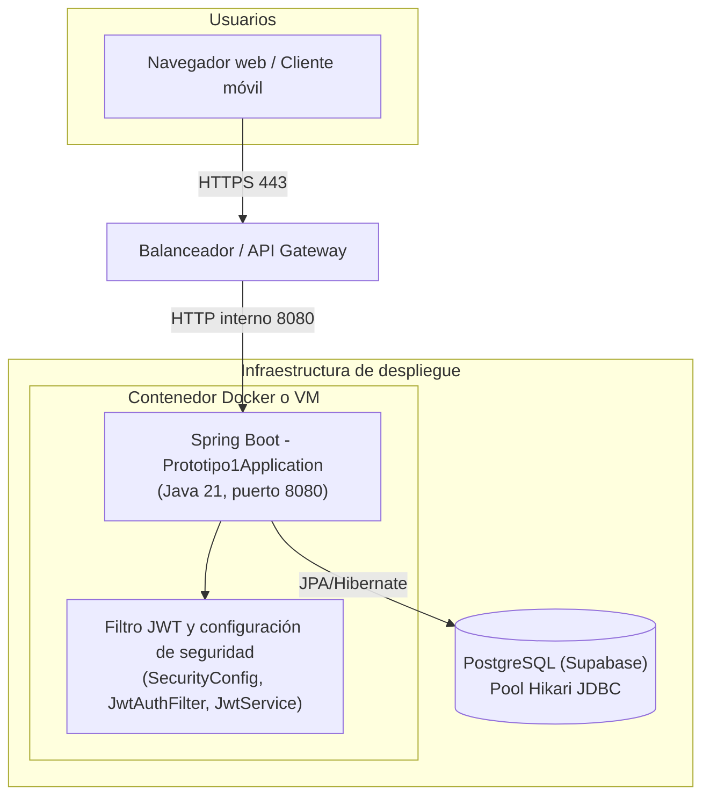

# Diagramas de arquitectura

## Diagrama de componentes
La aplicación sigue una arquitectura clásica de Spring Boot por capas: los controladores REST publican las APIs y aplican restricciones de seguridad por rol, delegando la lógica de negocio a servicios especializados.【F:src/main/java/com/prototipo/prototipo1/Banco/BancoController.java†L10-L51】 Los servicios encapsulan reglas y orquestan la interacción con los repositorios (por ejemplo, el servicio de bancos y el dashboard analítico).【F:src/main/java/com/prototipo/prototipo1/Banco/BancoService.java†L8-L50】【F:src/main/java/com/prototipo/prototipo1/Dashboard/DashboardService.java†L14-L200】 Los repositorios se implementan con Spring Data JPA para persistir entidades en la base de datos relacional.【F:src/main/java/com/prototipo/prototipo1/Banco/BancoRepository.java†L1-L11】 La capa de seguridad cruza todas las peticiones mediante filtros JWT configurados en `SecurityConfig` y `JwtAuthFilter`, apoyándose en `JwtService` para validar los tokens.【F:src/main/java/com/prototipo/prototipo1/Config/SecurityConfig.java†L23-L74】【F:src/main/java/com/prototipo/prototipo1/Auth/JwtAuthFilter.java†L14-L43】【F:src/main/java/com/prototipo/prototipo1/Auth/JwtService.java†L15-L57】 El acceso a datos se materializa vía JPA hacia PostgreSQL, definido en `application.properties`.【F:src/main/resources/application.properties†L4-L22】

```mermaid
flowchart LR
    Client["Clientes web o móviles\n(Front-end SPA / Integraciones)"] -->|HTTP JSON + JWT| Controllers["Controladores REST\n(BancoController, ClienteController, DashboardController, ...)"]
    Controllers -->|Lógica de negocio| Services["Servicios de dominio\n(BancoService, DashboardService, ...)"]
    Services -->|Consultas y comandos| Repositories["Repositorios Spring Data JPA\n(BancoRepository, ...)"]
    Repositories -->|ORM Hibernate| Database[("Base de datos relacional\nPostgreSQL / H2 de pruebas")]
    Services -->|DTOs y agregaciones| Dashboard["DTOs y ensambladores\n(DashboardResponse, etc.)"]
    Security["Capa de seguridad\nSecurityConfig + JwtAuthFilter + JwtService"] -->|Filtra y autentica| Controllers
    Observability["Actuator / Endpoints de salud\n(DashboardController.health, etc.)"] ..> Controllers
```

## Diagrama de despliegue
En ejecución, la clase `Prototipo1Application` levanta el contenedor de Spring Boot dentro de una JVM Java 21 y expone los servicios REST en el puerto configurable (8080 por defecto).【F:src/main/java/com/prototipo/prototipo1/Prototipo1Application.java†L1-L13】【F:src/main/resources/application.properties†L1-L3】 El componente se despliega típicamente en una máquina virtual o contenedor (Docker/Kubernetes), detrás de un balanceador que atiende peticiones HTTPS. Dentro del proceso, los filtros de seguridad se encargan de validar JWT antes de delegar en los controladores y servicios.【F:src/main/java/com/prototipo/prototipo1/Config/SecurityConfig.java†L23-L74】【F:src/main/java/com/prototipo/prototipo1/Auth/JwtAuthFilter.java†L14-L43】 La persistencia se atiende mediante el pool de conexiones Hikari hacia PostgreSQL gestionado en Supabase, usando el driver JDBC configurado en las propiedades.【F:src/main/resources/application.properties†L4-L22】


